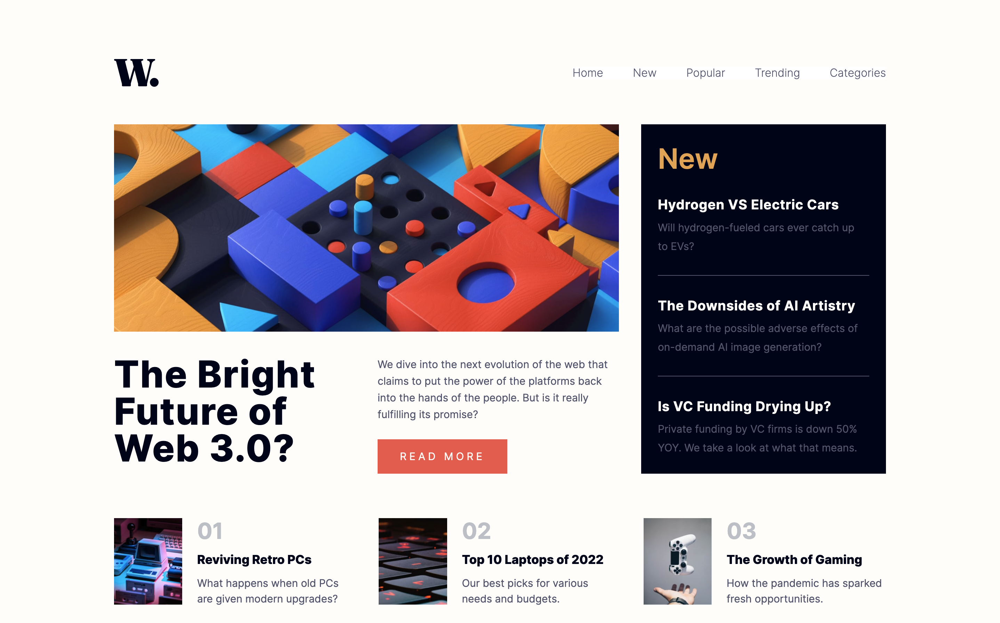

# Frontend Mentor - News homepage solution

This is a solution to the [News homepage challenge on Frontend Mentor](https://www.frontendmentor.io/challenges/news-homepage-H6SWTa1MFl). Frontend Mentor challenges help you improve your coding skills by building realistic projects. 

## Table of contents

- [Overview](#overview)
  - [The challenge](#the-challenge)
  - [Screenshot](#screenshot)
  - [Links](#links)
- [My process](#my-process)
  - [Built with](#built-with)
  - [What I learned](#what-i-learned)
  - [Continued development](#continued-development)
  - [Useful resources](#useful-resources)
- [Author](#author)
- [Acknowledgments](#acknowledgments)

## Overview

### The challenge

Users should be able to:

- View the optimal layout for the interface depending on their device's screen size
- See hover and focus states for all interactive elements on the page

### Screenshot



### Links

- Solution URL: [https://www.frontendmentor.io/solutions/collab-with-eric-responsive-news-page-with-mobile-menu-yLLgbRXVUf](https://www.frontendmentor.io/solutions/collab-with-eric-responsive-news-page-with-mobile-menu-yLLgbRXVUf)
- Live Site URL: [https://maiaflow.github.io/news-homepage/](https://maiaflow.github.io/news-homepage/)

## My process

### Built with

- Semantic HTML5 markup
- CSS custom properties
- Flexbox
- CSS Grid
- Mobile-first workflow
- JS
- SCSS
- Eric Salvi, my front end mentor <3. This time we built the project together using Visual Studio Code Live Share and Zoom screen share! We are submitting the same solution with different readmes.

### What I learned

```html
      <picture>
        <source 
          srcset="./assets/images/image-web-3-desktop.jpg"
          media="(min-width: 678px)"
        />
        
      </picture>
```

This really stumped us on one of our meetings, and I was happy I found this solution!

### Continued development

I want to get better at Git. Eric is pretty good at it and I'm pretty okay, but I want to be really good. 

### Useful resources

- [CSS-Tricks: A Guide to the Responsive Images Syntax in HTML](https://css-tricks.com/a-guide-to-the-responsive-images-syntax-in-html/) - So helpful for the <picture> element!

## Author

This was completed in collaboration with Eric!
- [@maiaflow](https://www.frontendmentor.io/profile/maiaflow)
- [@ericsalvi](https://www.frontendmentor.io/profile/ericsalvi)

## Acknowledgments

You already know!